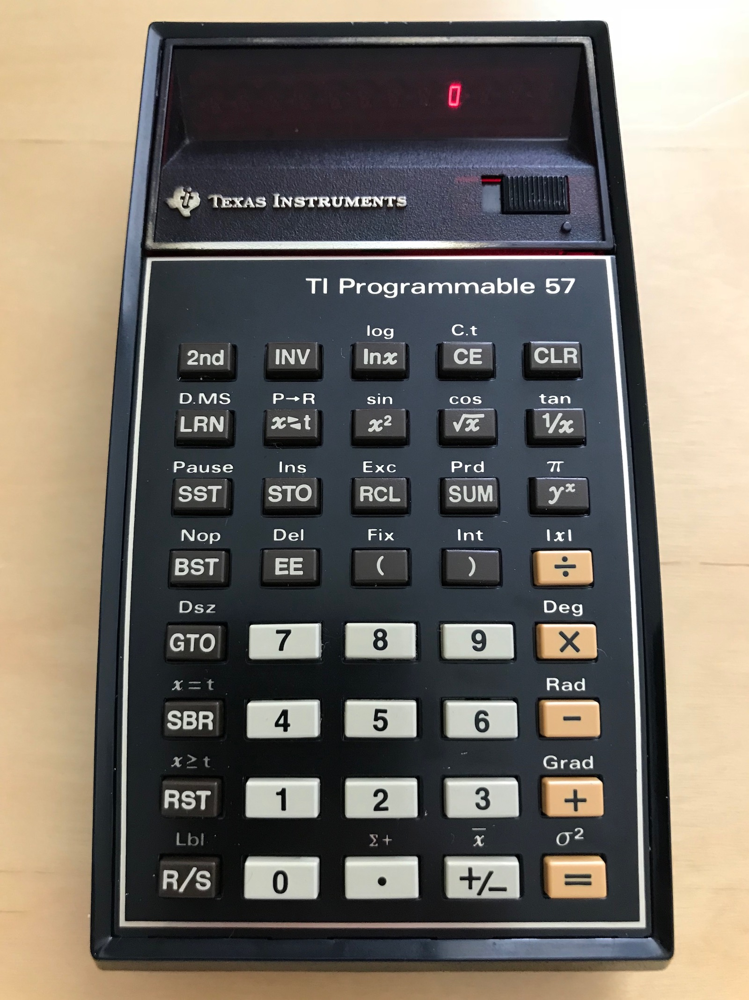
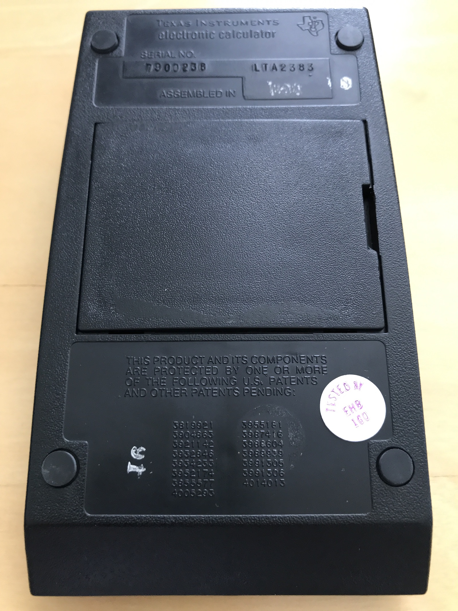
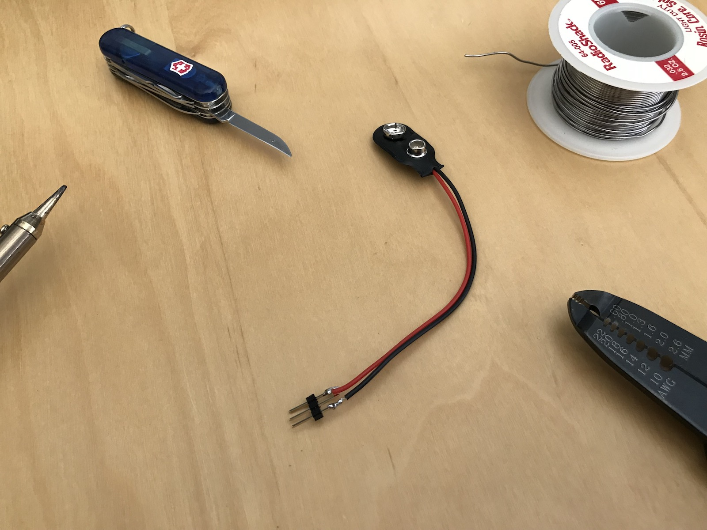
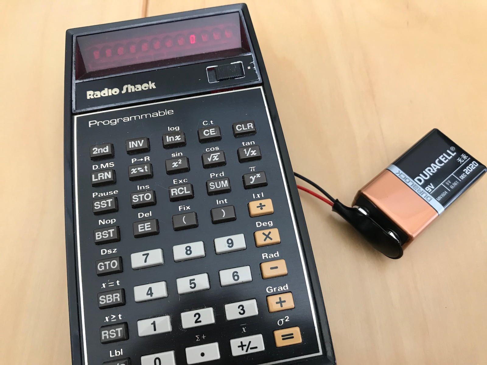

Texas Instruments TI-57
-----------------------

A PCjs emulator for the TI-57 Programmable Calculator is now available.  Ready-to-run configurations include:

- [TI-57 with Original ROM](machine/)
- [TI-57 with Original ROM and Diagnostics](machine/rev0/)
- [TI-57 with Revised ROM and Diagnostics](machine/rev1/)

Additional resources include:

- [TI-57 Documents](docs/)
- [TI-57 Patents](patents/)
- [TI-57 ROMs](rom/)
- [TI-57 Tips and Tricks](tips/)

My first programmable device was a TI-57; specifically, the Radio Shack EC-4000 version, Serial No. 9604427,
purchased on October 7, 1978.

Pictures of my EC-4000 are below.  I have a hunch that if I peeled off the Radio Shack sticker on
the back (underneath my custom Dymo label), it would say `Texas Instruments electronic calculator`.

I recently acquired an actual Texas Instruments-branded TI-57 as well, because while my EC-4000 still powers on,
a few of the buttons (like `0`) don't respond, and I wanted to have an operational TI-57 before taking my own apart.

The rechargeable batteries of both calculators were long dead, but it was easy enough to follow
[Dr. Monk's Advice](http://www.doctormonk.com/2014/06/ti-programmable-57-calculator-battery.html)
and "convert" both calculators to use a 9V battery.

