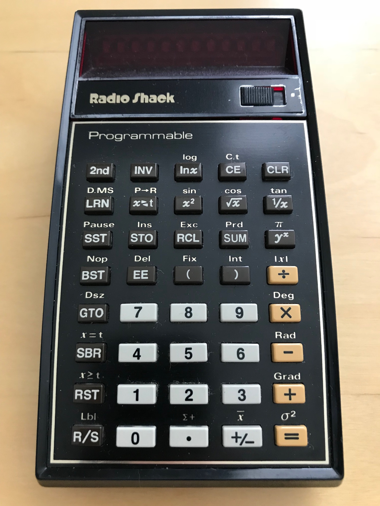
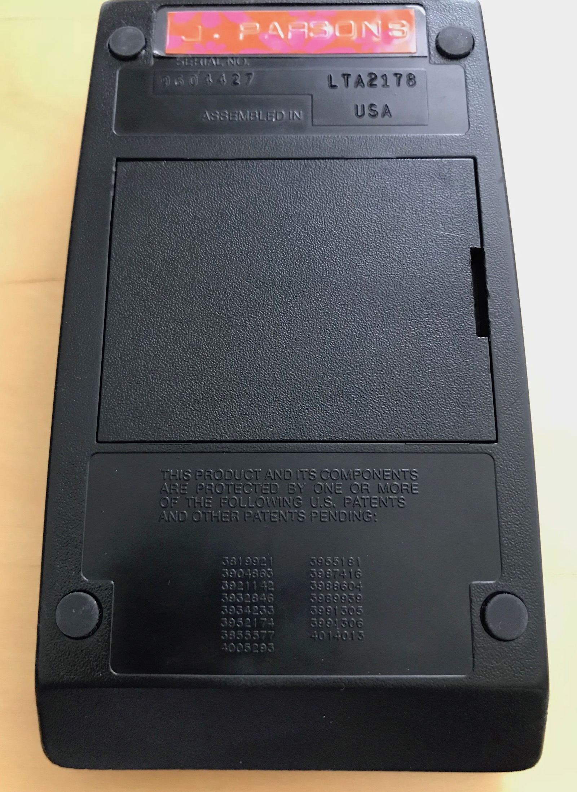
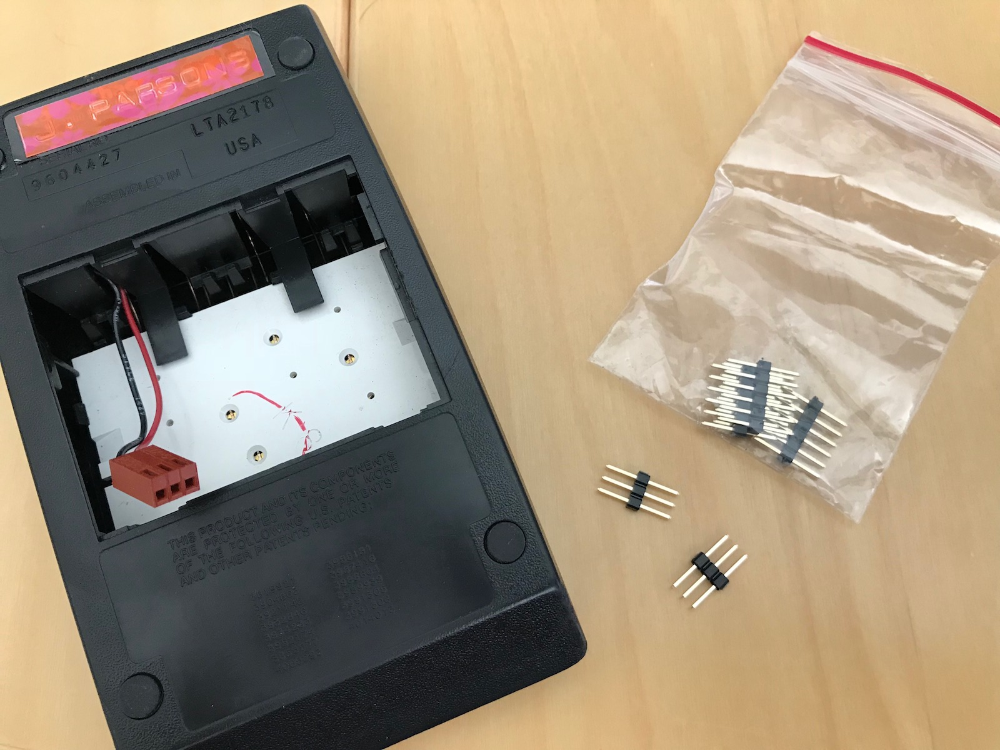
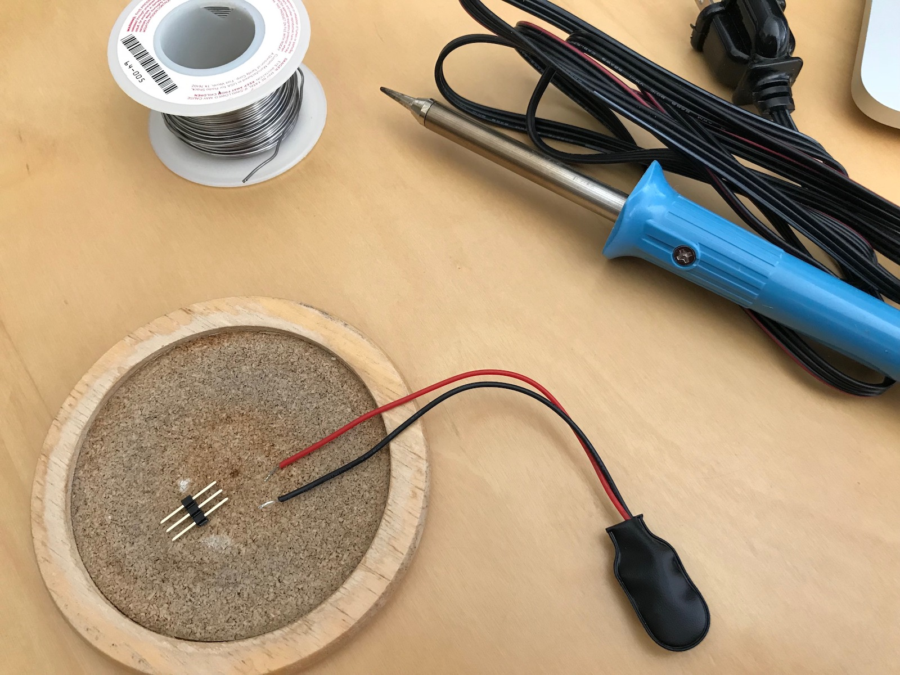

TI-57 Programmable Calculator
-----------------------------

This was my first programmable device.  I obtained mine (serial no. 9604427) on October 7, 1978, more than
two months before getting my first personal computer, the 6502-based [Challenger 1P](/devices/c1p/).

Additional resources include:

- [TI-57 Documents](docs/)
- [TI-57 Patents](patents/)
- [TI-57 ROMs](rom/)
- [TI-57 Test Page](machine/)

Below, you can see that mine was technically a Radio Shack EC-4000, but that was just rebranding.  I have a
hunch that if I peeled off the Radio Shack sticker on the back (underneath my custom Dymo label), it would say
`Texas Instruments electronic calculator`.

I recently acquired a Texas Instruments TI-57 as well, because while my EC-4000 still powers on, a few of the buttons
(like `0`) don't respond, and I wanted to have an operational TI-57 before taking my own apart.

The rechargeable batteries of both calculators were long dead, but it was easy enough to follow
[Dr. Monk's Advice](http://www.doctormonk.com/2014/06/ti-programmable-57-calculator-battery.html)
and "convert" both calculators to use a 9V battery.

