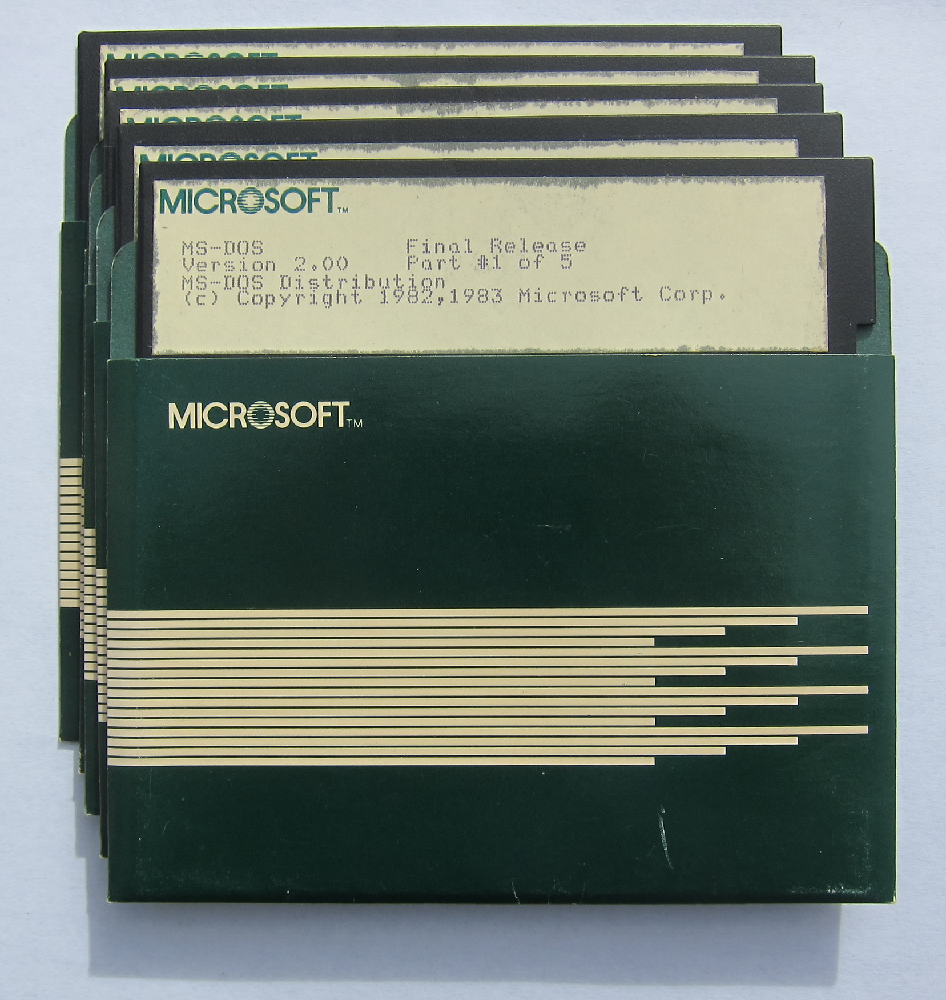

Microsoft MS-DOS 2.00
---------------------

There was no MS-DOS 2.00 product *per se*.  Instead, there were OEM releases of MS-DOS based on version 2.00,
including:

* [COMPAQ MS-DOS 2.12](/disks/pcx86/dos/compaq/2.12/)

MS-DOS 2.00 Source Code
-----------------------

On March 25, 2014, the source code upon which OEMs based their MS-DOS 2.x releases was made available to the
public by the [Computer History Museum](http://www.computerhistory.org/atchm/microsoft-ms-dos-early-source-code/),
with the permission of Microsoft.

For reasons known only to the Computer History Museum, the precise contents of the five diskettes donated to the
museum remain a mystery.  Instead, the museum released a ZIP archive with the contents of the diskettes divided into
two folders, `v20object` and `v20source`, with no clear indication which files came from which disk, why some files
were renamed (and what the original names were), and what (if anything) was omitted.

We have divided the contents of the `v20object` folder into two 320Kb "binary" disk images and the contents of the
`v20source` folder into six 320Kb "source" disk images, to make it easier to inspect all the files from "virtually" any
PCjs machine.

### Directory of MS-DOS 2.00 (Binary Disk 1)

	 Volume in drive A is MSDOS200B01
	 Directory of  A:\

	ANSI     DOC     6784   1-27-83   2:31p
	CHKDSK   COM     6330   2-01-83   8:16a
	COMMAND  COM    15480   2-08-83   6:50p
	CONFIG   DOC     3456   1-27-83   2:35p
	CREF     EXE    13824   6-02-82   6:06p
	DEBUG    COM    11764   2-01-83   9:13a
	DEVDRIV  DOC    37888   1-27-83   2:22p
	DISKCOPY COM     1419   2-14-83   3:39p
	DOSPATCH TXT     2546   2-08-83   7:04p
	EDLIN    COM     4389   2-01-83   5:45p
	EXE2BIN  EXE     1649   2-01-83   8:19a
	FC       EXE     2553   2-01-83   8:36a
	FILBP    PAS     6144   1-28-83   5:08p
	FIND     EXE     5796   1-14-83   5:35p
	FORMAT   DOC    16640   2-03-83   2:37p
	FORMAT   OBJ     4864   2-03-83   1:18p
	FORMES   OBJ     1152   2-03-83   1:03p
	INCOMP   DOC     2688   1-27-83   2:42p
	INT24    DOC     4224   1-27-83   2:30p
	LINK     EXE    42368   1-06-83   3:36p
	MASM     EXE    77440   2-01-83  12:13p
	MORE     COM     4364   1-14-83   5:42p
	MSDOS    SYS    16690   2-08-83   6:48p
	       23 File(s)     19456 bytes free

### Directory of MS-DOS 2.00 (Binary Disk 2)

	 Volume in drive A is MSDOS200B02
	 Directory of  A:\

	PRINT    COM     3808   2-01-83  11:39a
	PROFIL   OBJ     2304  10-28-82   5:32p
	PROFILE  DOC     3968   1-27-83   2:34p
	PROHST   EXE    41728   1-28-83   4:51p
	PROHST   PAS    11520   1-28-83   5:07p
	QUICK    DOC     3456   1-27-83   2:39p
	README   DOC     8832   1-01-80  12:00a
	RECOVER  COM     2277   2-01-83   1:22p
	SORT     EXE     1216   2-08-83   6:04p
	SYS      COM      850   2-01-83   1:26p
	SYSCALL  DOC    59136   1-27-83   2:18p
	SYSIMES  OBJ      384   1-24-83  10:42a
	SYSINIT  DOC     3072   1-27-83   2:40p
	SYSINIT  OBJ     3328   2-08-83   7:24p
	UTILITY  DOC    27776   1-27-83   2:26p
	       15 File(s)    141312 bytes free

### Directory of MS-DOS 2.00 (Source Disk 1)

	 Volume in drive A is MSDOS200S01
	 Directory of  A:\

	ALLOC    ASM    11648   8-18-83   2:26p
	ANSI     TXT     6784   1-27-83   2:31p
	BUF      ASM    14716   8-19-83  11:53a
	CHKDSK   ASM    26880   8-18-83   4:10p
	CHKMES   ASM    14080   8-18-83   4:14p
	CHKPROC  ASM    40704   8-18-83   4:12p
	COMEQU   ASM      900   8-25-83   3:06p
	COMLINK           128   8-18-83   3:18p
	COMMAND  ASM    23936   8-18-83   2:59p
	COMSEG   ASM      782   8-25-83   3:04p
	COMSW    ASM      512   1-01-80  12:00a
	CONFIG   TXT     3456   1-27-83   2:35p
	COPY     ASM    20480   8-18-83   3:14p
	COPYPROC ASM    18304   8-18-83   3:15p
	CPARSE   ASM     9472   8-18-83   3:15p
	CTRLC    ASM    14764   8-19-83  11:55a
	DEBASM   ASM    34304   8-18-83   4:03p
	DEBCOM1  ASM    27008   8-18-83   3:58p
	DEBCOM2  ASM    37356  10-20-83  10:28a
	       19 File(s)      7168 bytes free

### Directory of MS-DOS 2.00 (Source Disk 2)

	 Volume in drive A is MSDOS200S02
	 Directory of  A:\

	DEBCONST ASM    38912   8-18-83   4:07p
	DEBDATA  ASM     2816   8-18-83   4:07p
	DEBEQU   ASM     1280   1-01-80  12:12a
	DEBMES   ASM     5248   1-01-80  12:00a
	DEBUASM  ASM    21888   8-18-83   4:05p
	DEBUG    ASM    22016   8-18-83   3:56p
	DEV      ASM    12032   8-18-83   2:27p
	DEVDRIV  TXT    37888   1-27-83   2:22p
	DEVSYM   ASM     2688  10-18-82  12:07p
	DIR      ASM    29568   8-18-83   2:28p
	DIRCALL  ASM    14592   8-18-83   2:25p
	DISK     ASM    38016   8-18-83   2:30p
	DISKCOPY ASM     6656   1-01-80  12:00a
	DISKMES  ASM     7808   1-01-80  12:00a
	DOSLINK           141   8-25-83   4:46p
	DOSMAC   211     4395   9-12-83  10:41a
	DOSMAC   ASM     6656  10-18-82  12:06p
	DOSMES   ASM    14098   9-28-83   2:41p
	DOSSEG   ASM      357   8-25-83   3:04p
	DOSSYM   211    44887   8-25-83   3:05p
	       20 File(s)      1024 bytes free

### Directory of MS-DOS 2.00 (Source Disk 3)

	 Volume in drive A is MSDOS200S03
	 Directory of  A:\

	DOSSYM   ASM    42112   1-01-80  12:00a
	EDLIN    ASM    56960   1-01-80   1:08a
	EDLMES   ASM     3200   8-18-83   4:21p
	EDLPROC  ASM    13190   9-22-83  11:03p
	EXE2BIN  ASM    13824   1-01-80  12:00a
	EXEC     ASM    31011   8-19-83  11:59a
	EXEMES   ASM      768   1-01-80  12:00a
	FAT      ASM    10112   8-18-83   2:31p
	FC       ASM    65024   1-01-80  12:00a
	FCB      ASM    13392   8-19-83  11:52a
	FCMES    ASM     2048   1-01-80  12:00a
	FIND     ASM    39168   1-01-80  12:00a
	FINDMES  ASM     1408   1-01-80  12:00a
	FORMAT   TXT    16640   2-03-83   2:37p
	       14 File(s)      6144 bytes free

### Directory of MS-DOS 2.00 (Source Disk 4)

	 Volume in drive A is MSDOS200S04
	 Directory of  A:\

	FORMAT   ASM    46720   1-01-80   1:48p
	FORMES   ASM     4529   9-22-83  10:00p
	GENFOR   ASM     4096   2-03-83   1:45p
	GETSET   ASM    18048   8-18-83   2:14p
	HRDDRV   ASM    17536   1-01-80  12:00a
	IFEQU    ASM      303   8-25-83   3:06p
	INCOMP   TXT     2688   1-27-83   2:42p
	INIT     ASM    24832   8-18-83   3:01p
	INT24    TXT     4224   1-27-83   2:30p
	MISC     ASM    18304   8-18-83   2:13p
	MORE     ASM     3712   1-01-80   1:39a
	MOREMES  ASM      313   9-22-83   9:23p
	MSCODE   ASM    22208   1-03-80   4:25a
	MSDATA   ASM    11520   1-01-80  12:00a
	MSDOS    ASM      176   1-03-80   4:18a
	MSHEAD   ASM     9216   1-01-80  12:00a
	MSINIT   ASM    13568   1-01-80  12:00a
	PCLOCK   ASM     3200  10-28-82   5:32p
	PRINT    211    48000   1-01-80   1:42a
	PRINT    ASM    48000   2-01-83  11:37a
	       20 File(s)     11264 bytes free

### Directory of MS-DOS 2.00 (Source Disk 5)

	 Volume in drive A is MSDOS200S05
	 Directory of  A:\

	PROC     ASM     3222   8-19-83  11:55a
	PROFIL   ASM    21248  10-28-82   5:31p
	PROFILE  TXT     3968   1-27-83   2:34p
	PROHST   HLP     1536   1-28-83   5:06p
	QUICK    TXT     3456   1-27-83   2:39p
	RDATA    ASM     6784   8-18-83   3:00p
	README   TXT     8832   1-01-80  12:00a
	RECMES   ASM     5760   1-01-80  12:00a
	RECOVER  ASM    23808   1-01-80   2:01a
	ROM      ASM    14336   8-18-83   2:32p
	RUCODE   ASM     6912   8-18-83   2:59p
	SKELIO   ASM    45056   1-01-80  12:00a
	SORT     ASM    17099   9-22-83  10:27p
	SORTMES  ASM     2688   1-01-80   2:07a
	STDBUF   ASM      256   8-18-83   2:32p
	STDCALL  ASM      256   8-18-83   2:33p
	STDCTRLC ASM      256   8-18-83   2:39p
	STDFCB   ASM      193   1-03-80   6:40a
	STDIO    ASM      210   1-03-80   6:41a
	STDPROC  ASM      185   1-03-80   5:27a
	STDSW    ASM     1280   1-01-80  12:00a
	STRIN    ASM     9726   8-19-83  11:54a
	SYSCALL  ASM    21220   1-03-80   5:26a
	SYSCALL  TXT    59136   1-27-83   2:18p
	SYSIMES  ASM      512   1-01-80  12:00a
	SYSINIT  ASM    37644  10-12-83   9:24p
	       26 File(s)     14336 bytes free

### Directory of MS-DOS 2.00 (Source Disk 6)

	 Volume in drive A is MSDOS200S06
	 Directory of  A:\

	SYS      ASM    22784   9-22-83   9:29p
	SYSINIT  TXT     3072   1-27-83   2:40p
	SYSMES   ASM     1206   9-22-83   9:52p
	TCODE    ASM    33664   9-08-83   1:48a
	TCODE2   ASM    13568   8-18-83   3:05p
	TCODE3   ASM    16896   8-18-83   3:10p
	TCODE4   ASM    27392   8-18-83   3:11p
	TCODE5   ASM    24576   9-08-83   1:49a
	TDATA    ASM     9088   1-01-80  12:00a
	TIME     ASM     7040   8-18-83   2:45p
	TSPC     ASM     4480   8-18-83   3:17p
	TUCODE   ASM     7808   8-18-83   3:13p
	UINIT    ASM      896   1-01-80  12:00a
	UTILITY  TXT    27776   1-27-83   2:26p
	WSBAUD   BAS     1152   2-23-13   7:45a
	WSMSGS   OVR    27264   2-23-13   7:45a
	WSOVLY1  OVR    40960   2-23-13   7:45a
	XENIX    ASM    25984   1-03-80   5:57a
	XENIX2   ASM    17792   8-18-83   2:51p
	       19 File(s)      1024 bytes free
