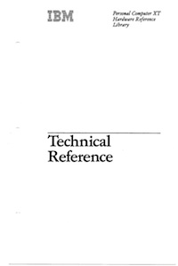
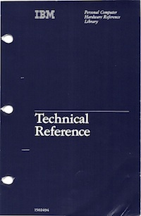
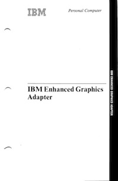

IBM PC Reference Manuals
------------------------

* [IBM 5150](5150/)
* [IBM 5160](5160/)
* [IBM 5170](5170/)
* [IBM Video Adapters](video/)

Featured Technical Reference manuals include:

* IBM 5150 [Guide to Operations](5150/operations/) and [Technical Reference](5150/techref/)
* IBM 5160 [Guide to Operations](5160/operations/) and [Technical Reference](5160/techref/)
* IBM 5170 [Installation and Setup](5170/setup/) and [Technical Reference](5170/techref/)
* IBM Enhanced Graphics Adapter [Technical Reference](video/ega/) and [Installation Instructions](https://1drv.ms/b/s!ArcO_mFRe1Z9gqESv2LrxGsMlNweRA)

